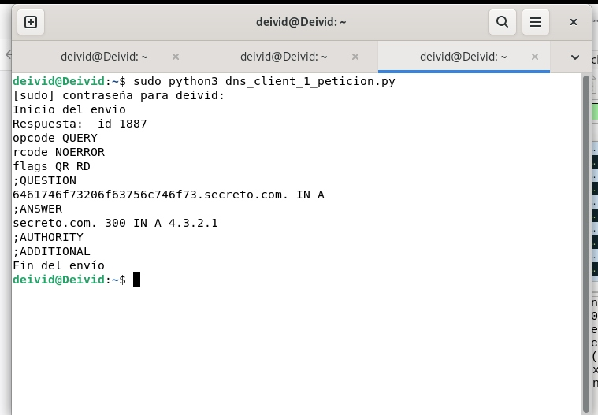
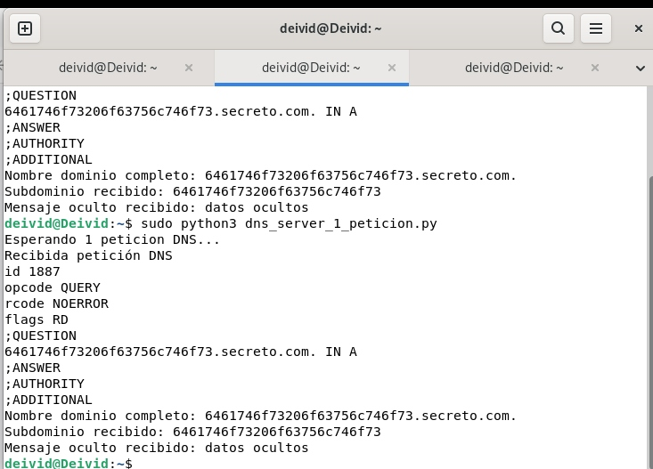
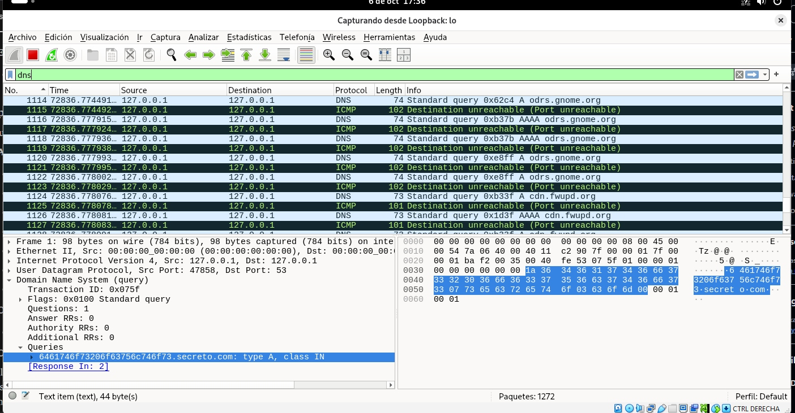

# ACT1 · Seguridad en DNS: DNS Tunneling

Práctica guiada del módulo **037 Seguridad en servicios**. Se analiza una comunicación DNS local en la que se transmite un mensaje hexadecimal dentro de un subdominio.

> Entorno: GNU/Linux · Python 3 · UDP/53 · Wireshark · interfaz loopback `127.0.0.1`.

---

## Ejecución

En una terminal se inicia el servidor DNS. Como utiliza el puerto 53, se ejecuta con permisos de administrador:

```bash
sudo python3 dns_server_1_peticion.py
```

En otra terminal de la misma máquina se lanza el cliente:

```bash
sudo python3 dns_client_1_peticion.py
```

### Cliente DNS

El cliente envía una consulta DNS de tipo `A` y recibe una respuesta correcta con `rcode NOERROR`.



---

## Datos transmitidos

La consulta utiliza el nombre de dominio:

```text
6461746f73206663756c746f73.secreto.com
```

El primer subdominio contiene el texto codificado en hexadecimal:

```text
6461746f73206663756c746f73
```

Al convertirlo desde hexadecimal a ASCII, se obtiene:

```text
datos ocultos
```

El servidor responde con el registro:

```text
secreto.com. 300 IN A 4.3.2.1
```

### Servidor DNS

El servidor recibe la petición, identifica el subdominio, recupera el mensaje `datos ocultos` y construye la respuesta DNS.



---

## Análisis con Wireshark

La captura se realizó en la interfaz `lo` aplicando el filtro:

```text
dns
```

Se observa una consulta DNS por UDP hacia el puerto 53, con origen y destino `127.0.0.1`. El nombre solicitado contiene el subdominio hexadecimal usado para transportar el mensaje.



---

## Conclusión

La práctica demuestra el funcionamiento básico de un canal de datos mediante DNS en un entorno controlado. El cliente incluye información codificada dentro de una consulta DNS válida y el servidor la recupera al procesar el subdominio.

En seguridad, nombres de dominio con etiquetas largas, codificadas o poco habituales pueden indicar comunicaciones de DNS tunneling, por lo que conviene supervisar las consultas DNS y sus patrones.

## Archivos de la actividad

```text
ACT1-dns-tunneling/
├── README.md
├── dns_client_1_peticion.py
├── dns_server_1_peticion.py
├── cliente_peticion.jpg
├── server.peticion.jpg
├── wireshark.jpg
└── docs/
    └── informe.md
```

## Autor

Deivid Cardona
