# ACT2 – Análisis y resolución del sistema DNS

> Módulo: 0375 Servicios de red · Ciclo: ASIX

## Objetivo

Esta actividad documenta la investigación del ecosistema DNS, la configuración de resolutores, la gestión de caché, el uso de `dig` para diagnóstico y el análisis posterior de paquetes DNS con Wireshark.

---

## 1. Ecosistema DNS: OSINT y Web

### 1.1 Jerarquía y organismos de gestión

DNS es un sistema jerárquico y distribuido. En la parte superior se encuentra la zona raíz (`.`), que delega la gestión de cada dominio de nivel superior o TLD, como `.es`, `.cat`, `.edu` y `.com`.

ICANN coordina globalmente el sistema de identificadores únicos de Internet. IANA, una función operada bajo el marco de ICANN, coordina entre otros elementos la zona raíz de DNS, los parámetros de protocolos de Internet y la asignación global de recursos numéricos.

#### Dominio `.es`

El dominio `.es` corresponde a España y su registry es Red.es. Esta entidad administra el registro del TLD y sus políticas de asignación.

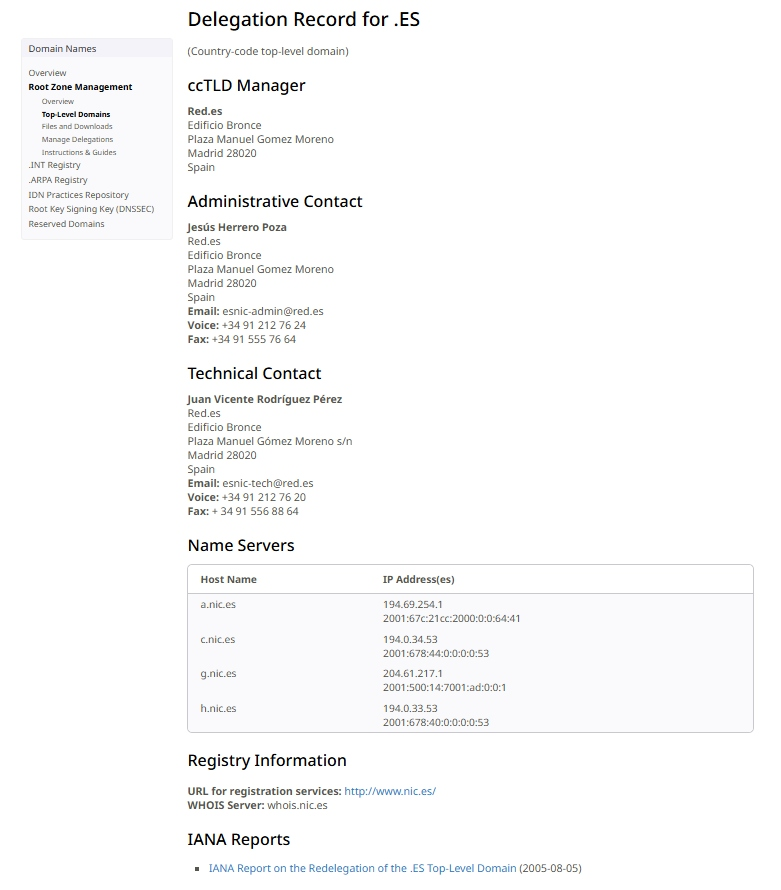

#### Dominio `.cat`

El dominio `.cat` está dirigido a la comunidad lingüística y cultural catalana. Su registry es la Fundació puntCAT.

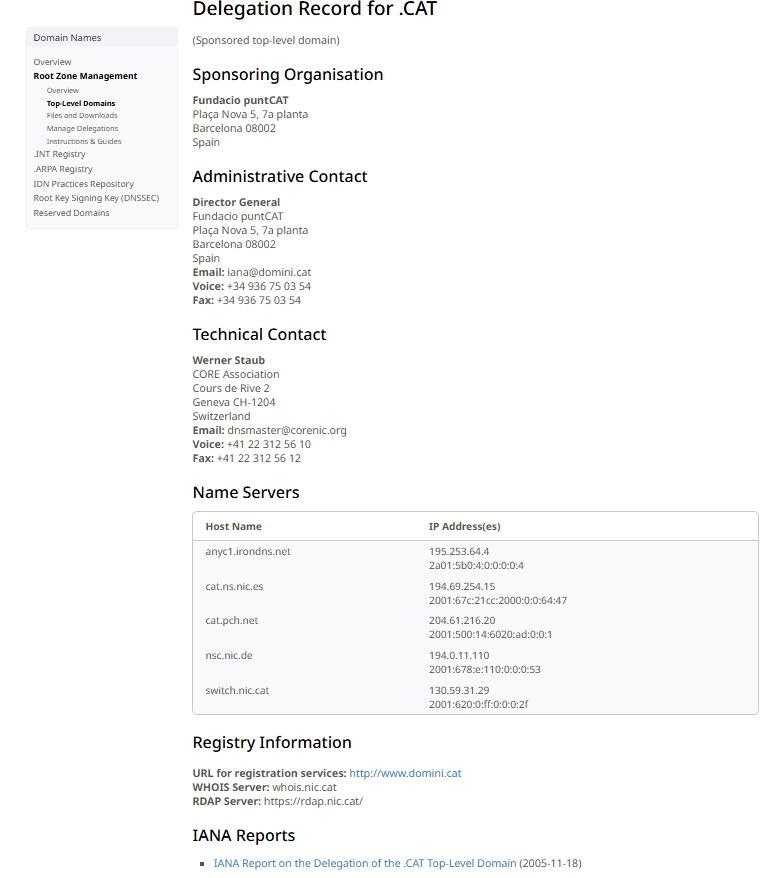

#### Dominio `.edu`

El dominio `.edu` se utiliza principalmente para instituciones de educación superior de Estados Unidos. Su registry es Educause.

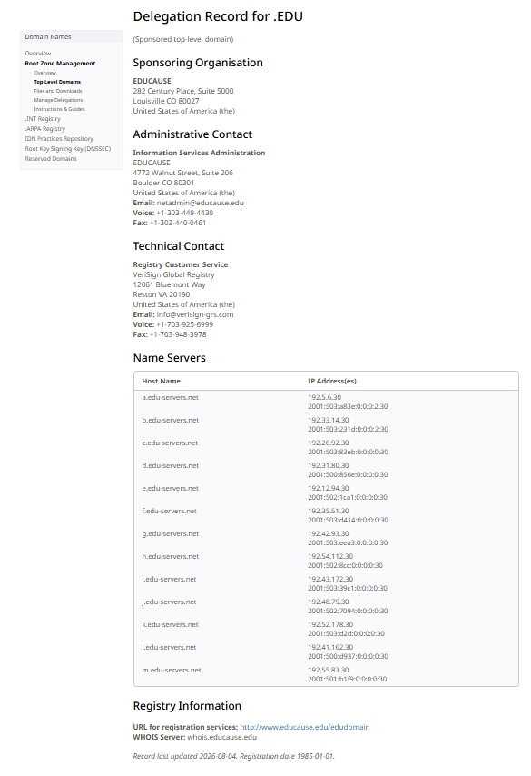

El dominio `ifp.es` no es un TLD: es un dominio de segundo nivel registrado bajo el TLD `.es`.

### 1.2 WHOIS, Registry y Registrar

Una consulta WHOIS ofrece información pública o técnica asociada a un dominio. Según las políticas de privacidad aplicables, puede mostrar el registrador, fechas de creación, actualización y caducidad, estados del dominio y los servidores DNS asociados; en algunos casos incluye datos de contacto.

En la consulta realizada sobre `ifp.es` se pueden identificar los datos publicados para el dominio y sus servidores de nombres.

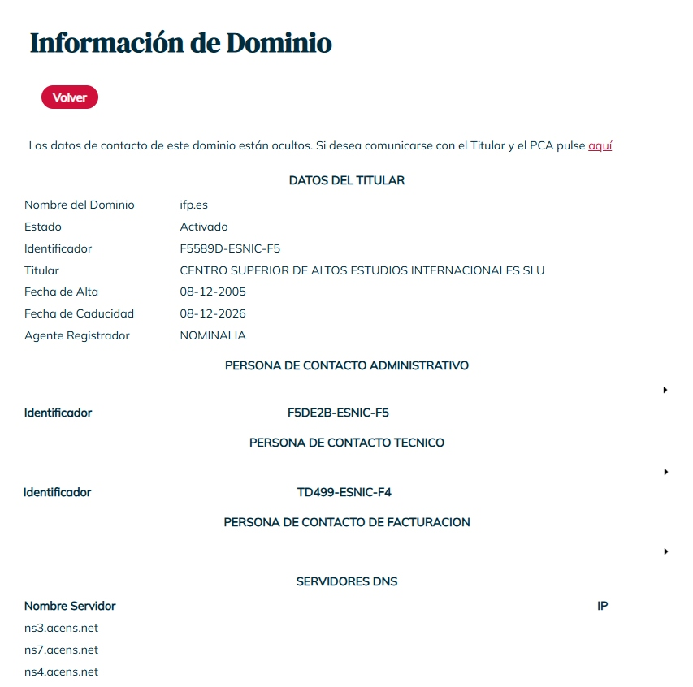

El **registry** es la entidad que mantiene la base de datos oficial y las políticas de un TLD. Por ejemplo, Red.es gestiona el registry de `.es`. El **registrar** es una empresa acreditada que registra, renueva y administra dominios para los usuarios finales, actuando como intermediaria entre el titular y el registry.

Por tanto, el registry administra la zona y el registro oficial del TLD, mientras que el registrar presta el servicio comercial de alta y gestión del dominio.

### 1.3 DNSSEC

DNSSEC (*Domain Name System Security Extensions*) añade firmas digitales a los datos DNS. Un resolvedor que valida DNSSEC puede comprobar que una respuesta procede de la zona autorizada y que no ha sido alterada durante la resolución.

Su objetivo es mitigar ataques de suplantación de DNS (*DNS spoofing*) y envenenamiento de caché. La validación se apoya en una cadena de confianza desde la zona raíz hasta el dominio consultado: las zonas publican registros criptográficos que permiten validar las firmas de las zonas delegadas.

DNSSEC aporta autenticidad e integridad de las respuestas, pero no cifra las consultas DNS. Para proteger la confidencialidad del tráfico se emplean mecanismos distintos, como DNS over TLS (DoT) o DNS over HTTPS (DoH).

### 1.4 Rendimiento DNS: DNS Benchmark

Se utilizó GRC DNS Benchmark para comparar el tiempo de respuesta de distintos resolutores desde la conexión empleada durante la práctica. La herramienta ordenó los servidores por rapidez de respuesta.

| Posición | Dirección IP | Empresa u operador |
|---:|---|---|
| 1 | `1.1.1.1` | Cloudflare, Inc. |
| 2 | `1.0.0.1` | Cloudflare, Inc. |
| 3 | `4.2.2.1` | Level 3 Parent, LLC / Lumen Technologies |

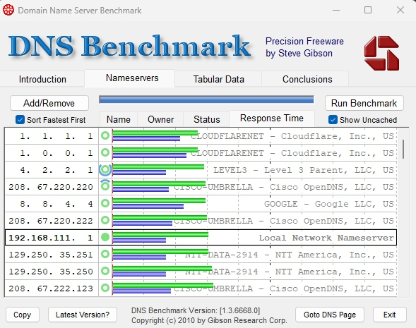

Los servidores de Cloudflare resultaron los más rápidos en esta medición. Por ello se seleccionaron `1.1.1.1` como DNS primario y `1.0.0.1` como DNS secundario para la fase de configuración. El resultado depende de la ubicación, el proveedor de Internet, la carga de los servidores y el momento de la prueba; no representa una clasificación universal.

---

## 2. Configuración y caché DNS

### 2.1 Consulta de servidores DNS asignados

Los servidores DNS configurados se pueden consultar desde consola. En Linux se puede utilizar:

```bash
cat /etc/resolv.conf
```

En Windows, el comando equivalente es:

```cmd
ipconfig /all
```

Ambos métodos permiten identificar los servidores DNS asociados a los adaptadores de red activos.

### 2.2 Cambio de servidores DNS

La configuración inicial del equipo utilizaba el DNS del router (`192.168.111.1`). Para realizar las pruebas se configuraron los DNS más rápidos obtenidos en el benchmark:

- DNS primario: `1.1.1.1` — Cloudflare.
- DNS secundario: `1.0.0.1` — Cloudflare.

El cambio se realizó temporalmente editando `/etc/resolv.conf`. La consulta posterior con `nslookup www.google.com` confirmó que la resolución se efectuaba mediante `1.1.1.1`.

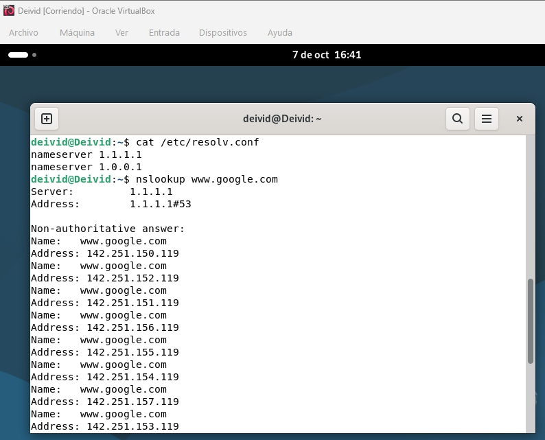

> Nota: en este equipo `/etc/resolv.conf` es generado por DHCP. Por eso, un reinicio o una renovación DHCP puede restaurar automáticamente los DNS proporcionados por el router.

### 2.3 DNS manual en dispositivos móviles

En Android se puede configurar DNS de una red Wi-Fi desde **Ajustes > Red e Internet (o Conexiones) > Wi-Fi > red seleccionada > editar/avanzado**. Según el dispositivo, se puede establecer DNS manual al usar IP estática o configurar **DNS privado**.

En iPhone o iPad se accede desde **Ajustes > Wi-Fi > icono de información (i) de la red > Configurar DNS > Manual**, donde se añaden los servidores deseados.

### 2.4 Comprobación de la caché DNS

La rúbrica propone `resolvectl statistics` como una opción habitual en Linux. En este equipo no estaba instalado ni activo `systemd-resolved`; por ello se instaló y activó `nscd` (*Name Service Cache Daemon*) como servicio local de caché DNS.

```bash
sudo apt update
sudo apt install -y nscd dnsutils
systemctl status nscd --no-pager
```

Después se generaron resoluciones mediante el resolvedor del sistema:

```bash
getent hosts www.google.com
getent hosts www.wikipedia.org
getent hosts www.github.com
```

Las estadísticas de la caché se consultaron con:

```bash
sudo /usr/sbin/nscd -g
```

La salida evidencia que la caché está activa y muestra valores almacenados, aciertos y fallos de caché.

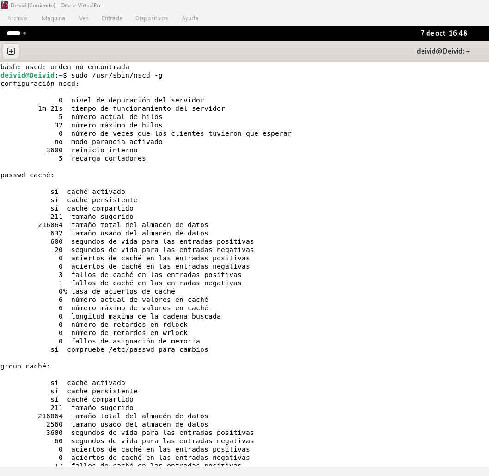

### 2.5 Vaciado de la caché DNS

La caché de resolución de nombres se vació con:

```bash
sudo nscd -i hosts
```

A continuación se consultó de nuevo el estado de `nscd` con `sudo /usr/sbin/nscd -g` para verificar la operación.


Vaciar la caché invalida las resoluciones guardadas y obliga al sistema a solicitar de nuevo la información al servidor DNS configurado. Es útil cuando un dominio ha cambiado de IP, se reciben respuestas antiguas o erróneas, se han modificado registros DNS o se está diagnosticando un problema de resolución.

---

## 3. Administración: troubleshooting con dig

En entornos Linux, `dig` permite consultar registros DNS concretos y analizar detalladamente las respuestas. Para las pruebas se utilizó el dominio `aliexpress.com`.

### 3.1 Consulta de registros A

Se ejecutó:

```bash
dig aliexpress.com
```

La sección `ANSWER SECTION` devolvió dos registros `A`, correspondientes a direcciones IPv4 del dominio:

```text
47.246.75.137
47.246.111.53
```

El campo `IN` identifica la clase Internet. La respuesta presentó estado `NOERROR`, lo que indica que la resolución fue correcta.

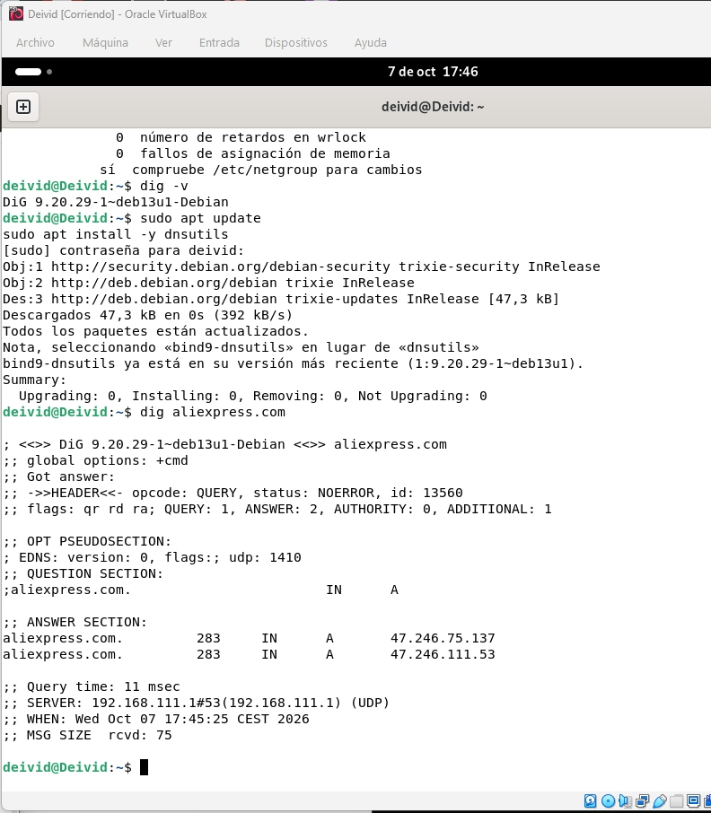

### 3.2 Formato corto, MX y NS

El siguiente comando muestra únicamente las respuestas:

```bash
dig +short aliexpress.com
```

Devolvió las direcciones `47.246.111.53` y `47.246.75.137`. Este formato es útil en scripts Bash porque elimina cabeceras y metadatos. Por ejemplo, `dig +short aliexpress.com | head -n 1` permite obtener la primera IP devuelta.

Para consultar el registro de correo se ejecutó:

```bash
dig MX aliexpress.com
```

El resultado fue `mx2.mail.aliyun.com` con preferencia `10`. En los registros MX, el número más bajo indica mayor prioridad.

Finalmente, la consulta:

```bash
dig NS aliexpress.com
```

identificó los servidores autoritativos de la zona:

- `ns1.alibabadns.com`
- `ns2.alibabadns.com`

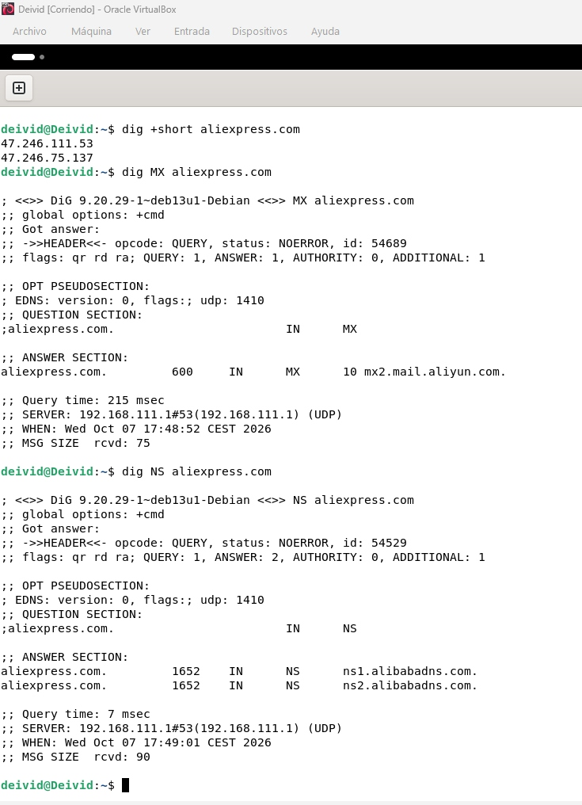

### 3.3 Autoridad y caché: TTL, SOA y NS

Se consultó dos veces el registro A de `aliexpress.com`, esperando cinco segundos entre ambas consultas. El TTL pasó de `600` a `595`, exactamente cinco segundos menos.

Esto demuestra que la respuesta se sirvió desde una caché DNS intermedia: el resolvedor conserva el registro mientras el TTL no llega a cero y reduce el contador a medida que transcurre el tiempo. En esta práctica, el DNS que respondió fue el router `192.168.111.1`.

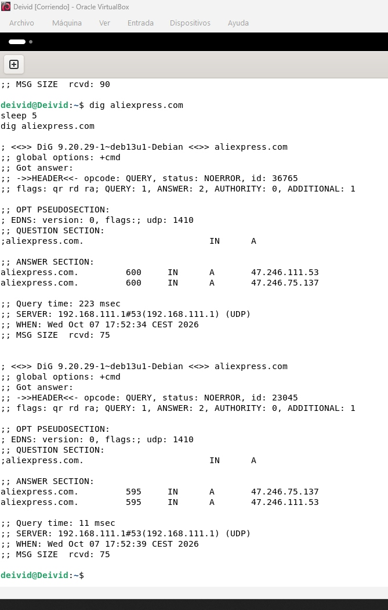

Un registro `SOA` (*Start of Authority*) identifica el inicio de autoridad de una zona e incluye información administrativa, como servidor principal, contacto responsable, número de serie y temporizadores de refresco, reintentos, expiración y TTL negativo.

Un registro `NS` (*Name Server*) indica los servidores de nombres que responden autoritativamente por una zona. El SOA describe parámetros de administración y sincronización de la zona, mientras que los NS identifican qué servidores tienen autoridad para responder por ella.

### 3.4 Trazabilidad completa con `dig +trace`

Se ejecutó:

```bash
dig +trace aliexpress.com
```

La traza muestra la resolución jerárquica completa:

1. El equipo parte de los servidores raíz, representados por `.` y nombres como `a.root-servers.net` hasta `m.root-servers.net`.
2. Un servidor raíz delega la consulta a los servidores responsables del TLD `.com`, como `a.gtld-servers.net`.
3. Los servidores del TLD `.com` indican los servidores autoritativos de `aliexpress.com`: `ns1.alibabadns.com` y `ns2.alibabadns.com`.
4. El servidor autoritativo responde finalmente con los registros A `47.246.75.137` y `47.246.111.53`.

Durante la traza aparecieron mensajes `network unreachable` para algunas direcciones IPv6. Esto no impidió la resolución porque `dig` continuó mediante IPv4 y obtuvo correctamente la respuesta final.

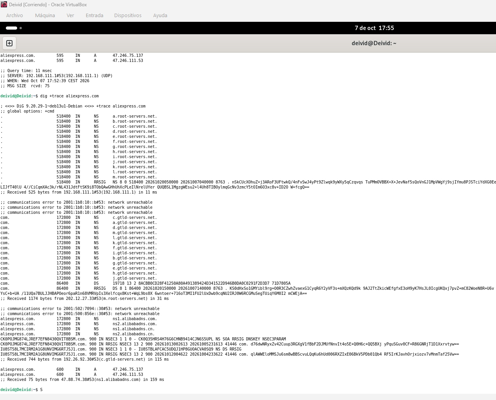

---

## 4. Análisis de tráfico DNS con Wireshark

> Sección preparada para documentar la captura y el análisis de una consulta MX. Se completará con las evidencias generadas durante la práctica.

### 4.1 Captura de la consulta MX

Se realizará una captura en la interfaz de red activa de Wireshark con el filtro de visualización `dns`. Mientras la captura esté activa se ejecutará:

```bash
nslookup -type=mx google.com
```

La evidencia mostrará la petición DNS (*query*) y la respuesta DNS (*response*) correspondientes.

### 4.2 Transporte y puertos

Pendiente de documentar a partir de la trama capturada: protocolo de transporte utilizado, puerto de origen dinámico del cliente y puerto de destino `53` del servidor DNS.

### 4.3 Identificador y flags

Pendiente de documentar a partir del bloque **Domain Name System**: el *Transaction ID* compartido por petición y respuesta, y el valor de la flag **Authoritative Answer** en la respuesta.

### 4.4 Respuestas MX y prioridad

Pendiente de documentar a partir de la sección **Answers**: servidores MX de Google recibidos y cuál tiene la preferencia más alta, es decir, el número más bajo.

---

## Evidencias

Las capturas de esta actividad se encuentran en la carpeta [`ACT2-dns-resolucion/`](./). La sección de Wireshark se completará con imágenes `13` a `16` tras realizar la captura de tráfico DNS.
