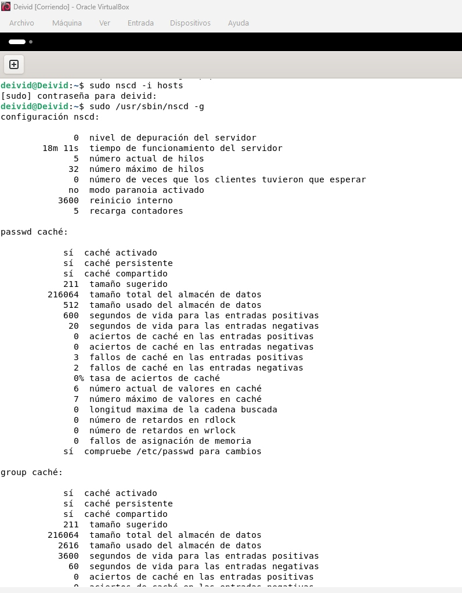

# ACT2 – DNS: resolución, caché y configuración

## 1. Investigación de dominios y DNS

En este apartado se ha realizado una investigación sobre varios dominios para entender cómo funciona la jerarquía del DNS y quién gestiona cada nivel.

### 1.1 Benchmark de servidores DNS

Se ejecutó un benchmark de servidores DNS públicos para identificar los tres más rápidos desde esta máquina. Los resultados sirvieron para seleccionar los DNS que se usarían en pruebas posteriores.


### 1.2 Búsqueda WHOIS de un dominio .es

Se utilizó la herramienta WHOIS para investigar el dominio `ifp.es` y obtener información sobre su registrador, fechas de creación y caducidad, y datos de contacto.


### 1.3 Información de dominios de primer nivel (TLD)

Se consultó la base de datos de IANA para obtener información oficial sobre tres dominios de primer nivel:

#### Dominio .es (España)

Gestionado por Red.es, es el dominio de primer nivel correspondiente a España.


#### Dominio .cat (comunidades lingüísticas y culturales catalanas)

Gestionado por la Fundació puntCAT, es el TLD para la comunidad lingüística y cultural catalana.


#### Dominio .edu (instituciones educativas)

Gestionado por Educause, está reservado principalmente para instituciones de educación superior de EE. UU.


Estas capturas muestran quién gestiona cada TLD, las políticas de registro y los servidores de nombres asociados.

---

## 2. Configuración y caché DNS

### 2.1 Consulta de los servidores DNS asignados

Los servidores DNS configurados se pueden consultar desde consola. En Linux se utilizó el comando:

```bash
cat /etc/resolv.conf
```

En Windows, el comando equivalente es:

```cmd
ipconfig /all
```

En ambos casos se muestra el servidor DNS asignado a cada adaptador de red.

### 2.2 Cambio de servidores DNS

La configuración inicial del equipo utilizaba el DNS del router (`192.168.111.1`). Para realizar las pruebas se configuraron los dos DNS más rápidos obtenidos en el benchmark de la fase 1:

- DNS primario: `1.1.1.1` (Cloudflare).
- DNS secundario: `1.0.0.1` (Cloudflare).

El cambio se realizó de forma temporal editando `/etc/resolv.conf`. La consulta posterior con `nslookup www.google.com` confirmó que la resolución se efectuaba mediante `1.1.1.1`.


> Nota: en este equipo el archivo `/etc/resolv.conf` es generado por DHCP. Por eso, un reinicio o una renovación DHCP puede restaurar automáticamente los DNS proporcionados por el router.

### 2.3 DNS manual en dispositivos móviles

En Android se puede configurar DNS para una red Wi-Fi desde **Ajustes > Red e Internet (o Conexiones) > Wi-Fi > red seleccionada > editar/avanzado**. Según el dispositivo, se puede establecer DNS manual al usar IP estática o configurar **DNS privado**.

En iPhone o iPad se accede desde **Ajustes > Wi-Fi > icono de información (i) de la red > Configurar DNS > Manual**, donde se añaden los servidores deseados.

### 2.4 Comprobación de la caché DNS

Inicialmente no estaba instalado `systemd-resolved` ni otro servicio de caché DNS local. Para disponer de una caché de resoluciones se instaló y activó `nscd` (*Name Service Cache Daemon*):

```bash
sudo apt update
sudo apt install -y nscd dnsutils
systemctl status nscd --no-pager
```

Después se generaron resoluciones mediante el resolvedor del sistema:

```bash
getent hosts www.google.com
getent hosts www.wikipedia.org
getent hosts www.github.com
```

Las estadísticas se consultaron con:

```bash
sudo /usr/sbin/nscd -g
```

La salida muestra que la caché está activa y presenta el número de valores almacenados, además de los aciertos y fallos de caché.


### 2.5 Vaciado de la caché DNS

La caché de resoluciones de nombres se vació con el siguiente comando:

```bash
sudo nscd -i hosts
```

A continuación, se volvió a consultar el estado de `nscd` con `sudo /usr/sbin/nscd -g` para verificar la operación.



Vaciar la caché DNS invalida las resoluciones almacenadas y obliga al sistema a volver a preguntar al servidor DNS configurado. Es útil para un administrador de sistemas cuando un dominio ha cambiado de dirección IP, se reciben respuestas antiguas o incorrectas, se modifica la configuración DNS o se diagnostican problemas de conectividad y resolución de nombres.

---

## Evidencias

Las evidencias de esta actividad se encuentran en la carpeta [`ACT2-dns-resolucion/`](./). La captura del vaciado de caché está temporalmente en la raíz del repositorio y se enlaza desde este README.