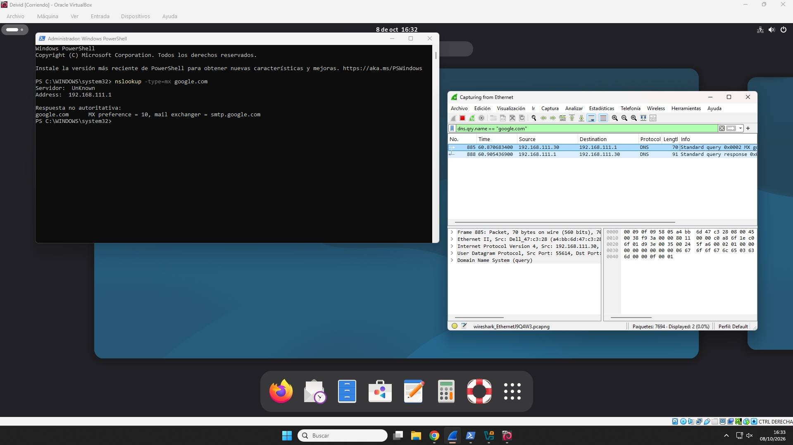
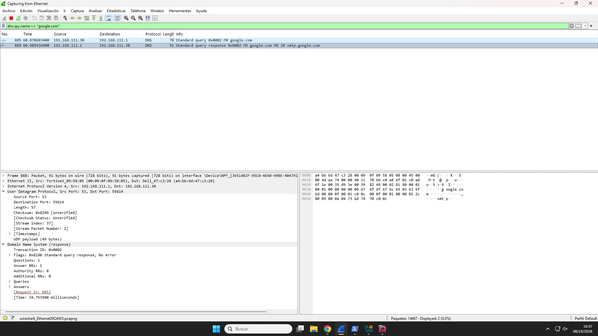
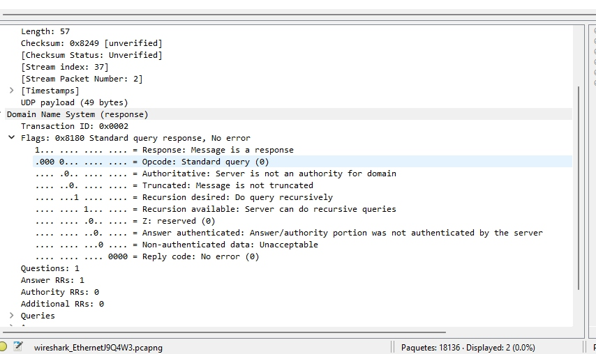
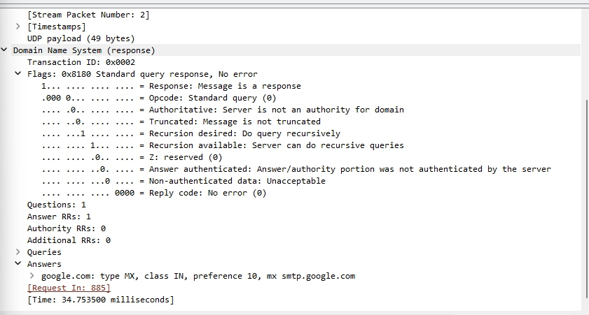

# Actividad 2 — Resolución DNS

## Índice

1. [Introducción y objetivos](#1-introducción-y-objetivos)
2. [Comparativa de servidores DNS](#2-comparativa-de-servidores-dns)
3. [Investigación de dominios y autoridades DNS](#3-investigación-de-dominios-y-autoridades-dns)
   - [Consulta WHOIS del dominio ifp.es](#31-consulta-whois-del-dominio-ifpes)
   - [Información de dominios en IANA](#32-información-de-dominios-en-iana)
4. [Configuración local del servicio DNS](#4-configuración-local-del-servicio-dns)
   - [Cambio del servidor DNS en Linux](#41-cambio-del-servidor-dns-en-linux)
   - [Gestión de la caché DNS con NSCD](#42-gestión-de-la-caché-dns-con-nscd)
5. [Resolución de nombres con dig](#5-resolución-de-nombres-con-dig)
   - [Consulta de registro A](#51-consulta-de-registro-a)
   - [Consulta de registros MX y NS](#52-consulta-de-registros-mx-y-ns)
   - [Consulta del TTL](#53-consulta-del-ttl)
   - [Trazado completo de resolución DNS](#54-trazado-completo-de-resolución-dns)
6. [Análisis de tráfico DNS con Wireshark](#6-análisis-de-tráfico-dns-con-wireshark)
   - [Consulta y respuesta DNS](#61-consulta-y-respuesta-dns)
   - [Puertos UDP utilizados](#62-puertos-udp-utilizados)
   - [ID de transacción y flags](#63-id-de-transacción-y-flags)
   - [Registros MX en la respuesta](#64-registros-mx-en-la-respuesta)
7. [Conclusiones](#7-conclusiones)

## 1. Introducción y objetivos

Esta actividad estudia el funcionamiento de la resolución de nombres mediante DNS. Se realizan consultas sobre dominios, se analiza la configuración local del resolutor, se revisa el uso de la caché DNS y se inspecciona el tráfico generado con Wireshark.

Los objetivos son identificar las entidades responsables de los dominios, consultar registros DNS con `dig`, comprender el proceso de resolución y analizar los campos principales de los paquetes DNS.

## 2. Comparativa de servidores DNS

Se realiza una comparativa de rendimiento entre distintos servidores de nombres para observar sus tiempos de respuesta.


## 3. Investigación de dominios y autoridades DNS

### 3.1 Consulta WHOIS del dominio ifp.es

La consulta WHOIS permite consultar la información de registro asociada a un dominio, como la entidad responsable y otros datos administrativos disponibles.


### 3.2 Información de dominios en IANA

IANA mantiene información de referencia sobre los dominios de nivel superior. A continuación se muestran las consultas realizadas para los dominios `.es`, `.cat` y `.edu`.

#### Dominio .es


#### Dominio .cat


#### Dominio .edu


## 4. Configuración local del servicio DNS

### 4.1 Cambio del servidor DNS en Linux

Se modifica la configuración del equipo Linux para utilizar el servidor DNS indicado en la actividad.


### 4.2 Gestión de la caché DNS con NSCD

NSCD permite almacenar en caché información de servicios de nombres. Se comprueba el estado de la caché y se realiza su vaciado para evitar que consultas anteriores afecten a nuevas pruebas.

#### Estado de la caché DNS


#### Vaciado de la caché DNS


## 5. Resolución de nombres con dig

### 5.1 Consulta de registro A

Se realiza una consulta de tipo `A` para obtener la dirección IPv4 asociada al dominio analizado.

```bash
dig A aliexpress.com
```


### 5.2 Consulta de registros MX y NS

Se consultan los registros de correo y los servidores de nombres autoritativos asociados al dominio.

```bash
dig +short MX aliexpress.com
dig +short NS aliexpress.com
```


### 5.3 Consulta del TTL

El TTL indica durante cuánto tiempo puede conservarse una respuesta DNS en caché antes de volver a consultarse.

```bash
dig aliexpress.com
```


### 5.4 Trazado completo de resolución DNS

La opción `+trace` permite visualizar el recorrido de la resolución, desde los servidores raíz hasta el servidor autoritativo del dominio.

```bash
dig +trace aliexpress.com
```


## 6. Análisis de tráfico DNS con Wireshark

### 6.1 Consulta y respuesta DNS

Se captura una consulta DNS de tipo MX y la respuesta proporcionada por el servidor DNS.



### 6.2 Puertos UDP utilizados

El tráfico DNS se realiza normalmente mediante UDP. En la captura se identifica el puerto efímero de origen del cliente y el puerto 53 de destino del servidor DNS.



### 6.3 ID de transacción y flags

El ID de transacción permite asociar una respuesta con su consulta. Los flags indican características y estado del mensaje DNS, como si se trata de una respuesta o si la resolución fue correcta.



### 6.4 Registros MX en la respuesta

La sección de respuestas contiene los registros MX devueltos para el dominio consultado, que indican los servidores responsables de recibir correo electrónico.



## 7. Conclusiones

La actividad permite comprobar cómo se resuelven los nombres de dominio mediante DNS, desde la consulta de registros y el uso de caché local hasta el análisis de los paquetes intercambiados entre cliente y servidor. El uso de `dig` y Wireshark facilita la interpretación tanto de las respuestas DNS como de los campos que intervienen en el protocolo.