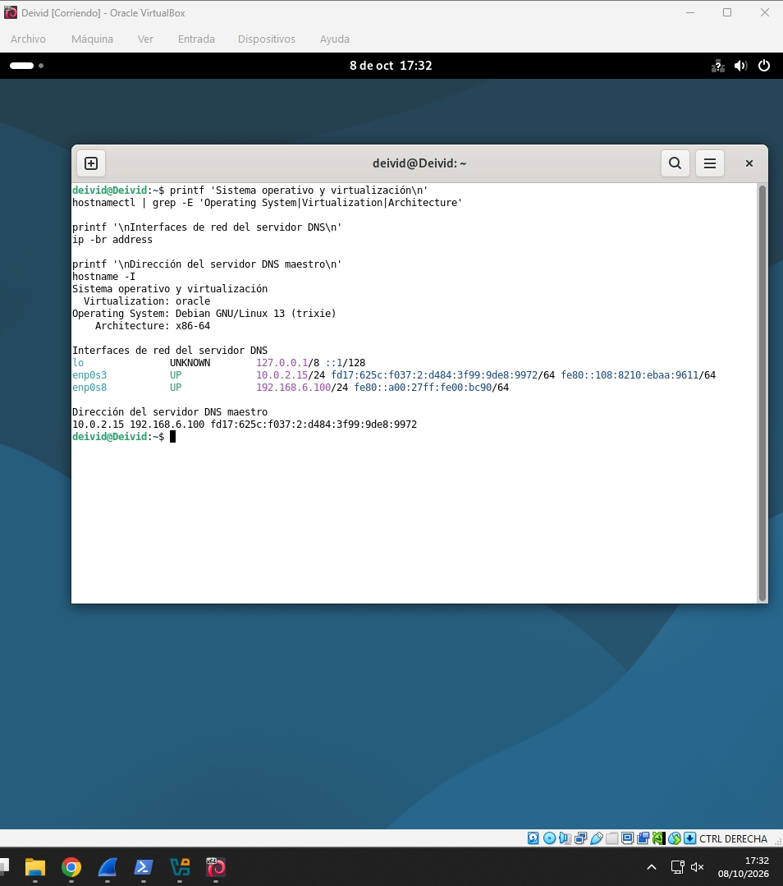
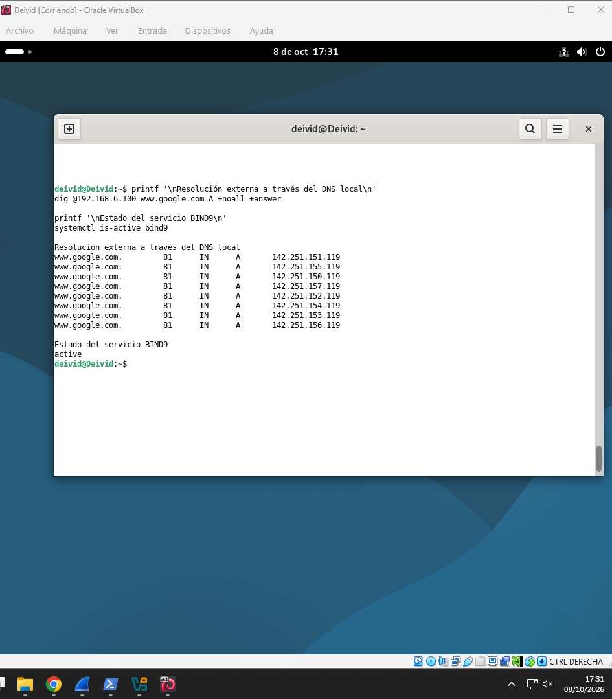
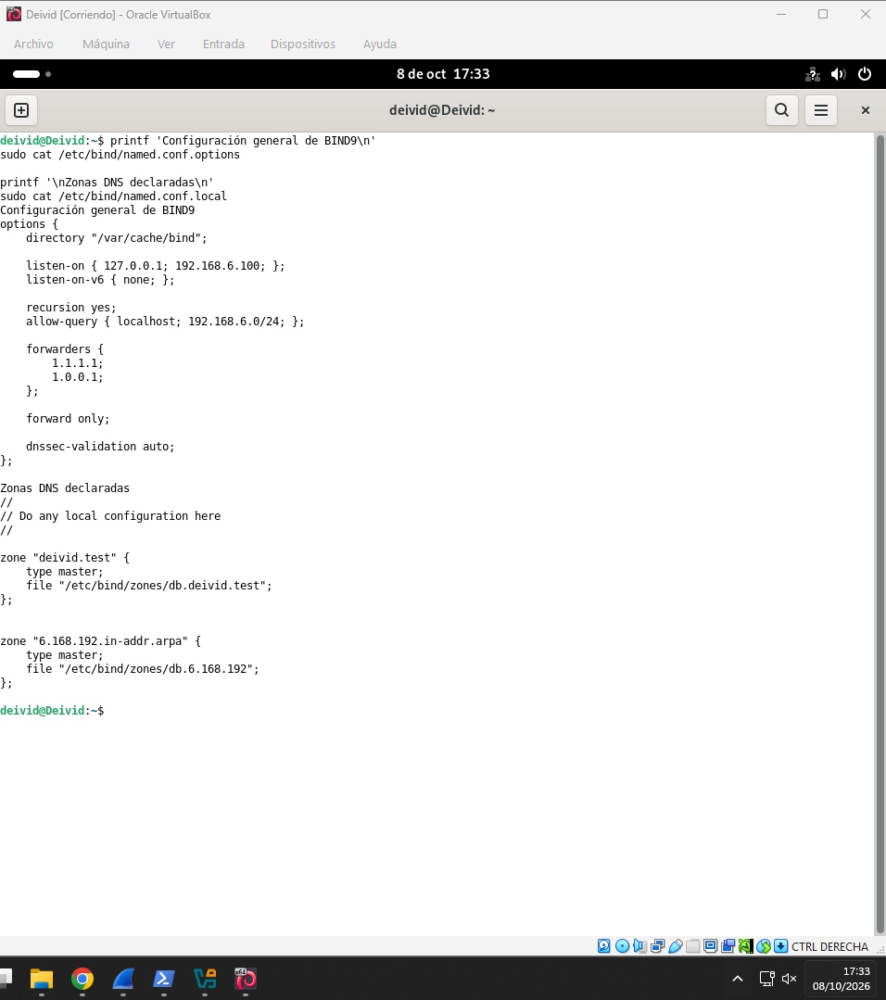
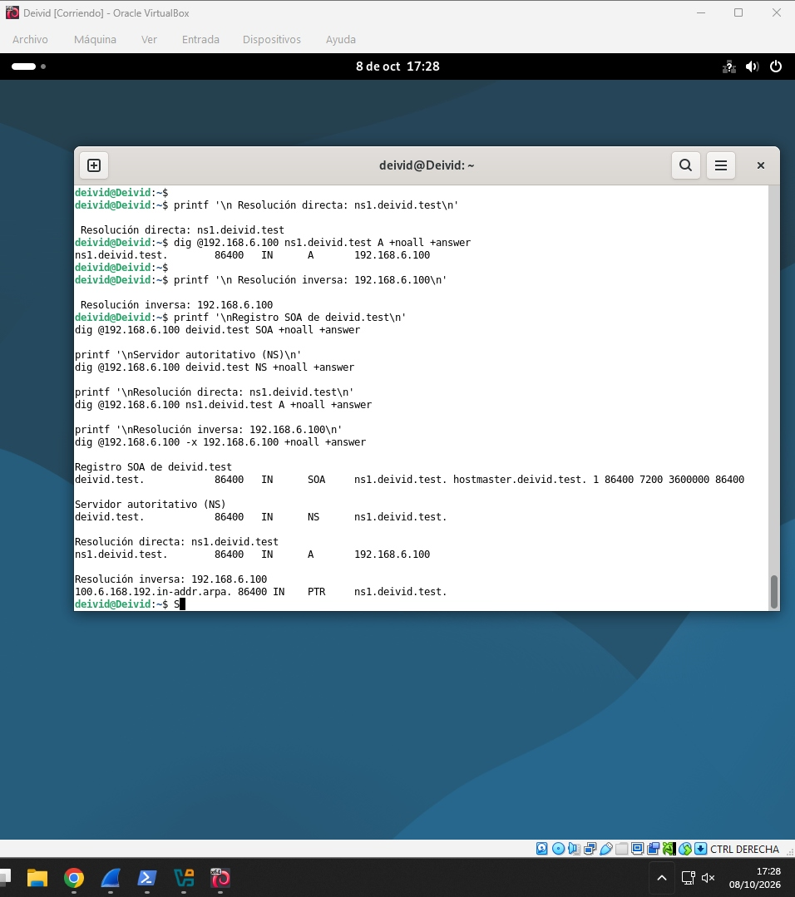

# ACT3 — Instalación y configuración de BIND9

> Práctica de despliegue de un servidor DNS autoritativo con BIND9, configuración de zonas directa e inversa y validación de la resolución local.

## Índice

- [Objetivo](#objetivo)
- [Escenario y arquitectura](#escenario-y-arquitectura)
- [Preparación del entorno](#1-preparación-del-entorno)
- [Instalación y servicio BIND9](#2-instalación-y-servicio-bind9)
- [Configuración de zonas](#3-configuración-de-zonas)
- [Validación DNS](#4-validación-dns)
- [Operación y mantenimiento](#operación-y-mantenimiento)
- [Evidencias](#evidencias)

---

## Objetivo

El objetivo de esta actividad es instalar y dejar operativo **BIND9** como servidor DNS en una máquina virtual GNU/Linux. La configuración incluye una zona de búsqueda directa —nombre a dirección IP— y una zona inversa —dirección IP a nombre—, comprobando finalmente que ambas consultas son respondidas por el servicio local.

## Escenario y arquitectura

La máquina virtual actúa como servidor DNS. BIND9 carga la configuración global y las declaraciones de zona, consulta los archivos de zona y atiende las peticiones DNS en el puerto 53.

```text
┌─────────────────────────┐        consultas DNS        ┌─────────────────────────────┐
│ Cliente / terminal      │ ─────────────────────────▶ │ Servidor BIND9              │
│ dig · nslookup · host   │ ◀───────────────────────── │ zona directa + zona inversa │
└─────────────────────────┘        respuestas DNS       └──────────────┬──────────────┘
                                                                        │
                                                       ┌────────────────┴────────────────┐
                                                       │ /etc/bind/named.conf.local       │
                                                       │ archivo de zona directa          │
                                                       │ archivo de zona inversa          │
                                                       └─────────────────────────────────┘
```

| Elemento | Función en la práctica |
|---|---|
| BIND9 | Servicio DNS que procesa las consultas. |
| Zona directa | Asocia nombres de host con registros `A`. |
| Zona inversa | Asocia direcciones IP con registros `PTR`. |
| `dig` / `nslookup` | Herramientas usadas para validar la resolución. |

---

## 1. Preparación del entorno

Antes de configurar el servicio se revisa la máquina virtual y su conectividad de red. El adaptador debe permitir que el sistema alcance su puerta de enlace y los servidores externos necesarios para instalar paquetes o resolver consultas fuera de la zona local.



**Figura 1.** Entorno de la máquina virtual y parámetros de red empleados durante la práctica.

### Pasos

1. Iniciar la máquina virtual y comprobar que la interfaz de red tiene una dirección IP válida.
2. Verificar la conectividad con la puerta de enlace y, si procede, con una dirección externa.
3. Confirmar que el nombre de la interfaz y la dirección de red coinciden con los valores que se utilizarán en las zonas DNS.

---

## 2. Instalación y servicio BIND9

BIND9 se instala desde los repositorios de la distribución. Tras la instalación, se comprueba que el demonio queda habilitado y en ejecución antes de declarar las zonas propias.

```bash
sudo apt update
sudo apt install bind9 bind9utils dnsutils
sudo systemctl enable --now bind9
sudo systemctl status bind9
```



**Figura 2.** Comprobación de resolución externa y verificación de que el servicio `bind9` está activo.

### Validación esperada

- `systemctl status bind9` muestra el servicio como `active (running)`.
- El sistema mantiene conectividad para consultas DNS externas.
- El puerto DNS queda disponible para las consultas configuradas en el host.

---

## 3. Configuración de zonas

La configuración se centraliza en `/etc/bind/`. El archivo `named.conf.local` declara las zonas que administra el servidor y cada zona apunta a su correspondiente archivo de registros.

```conf
zone "ejemplo.local" {
    type master;
    file "/etc/bind/db.ejemplo.local";
};

zone "0.168.192.in-addr.arpa" {
    type master;
    file "/etc/bind/db.192.168.0";
};
```

> Los nombres y la red anteriores son un ejemplo de estructura. En la práctica se deben conservar los valores configurados en las capturas y en los archivos de zona del entorno.



**Figura 3.** Declaración de las zonas en BIND9 y edición de los archivos de zona directa e inversa.

### Zona directa

La zona directa define registros como los siguientes:

```dns
@       IN  SOA ns1.ejemplo.local. admin.ejemplo.local. (
            2026100801 ; Serial
            604800     ; Refresh
            86400      ; Retry
            2419200    ; Expire
            604800 )   ; Negative Cache TTL

@       IN  NS  ns1.ejemplo.local.
ns1     IN  A   192.168.0.10
host1   IN  A   192.168.0.20
```

### Zona inversa

La zona inversa permite recuperar un nombre a partir de una IP:

```dns
@       IN  SOA ns1.ejemplo.local. admin.ejemplo.local. (
            2026100801 604800 86400 2419200 604800 )
@       IN  NS  ns1.ejemplo.local.
10      IN  PTR ns1.ejemplo.local.
20      IN  PTR host1.ejemplo.local.
```

### Comprobación sintáctica

Antes de reiniciar el servicio conviene validar archivos y configuración:

```bash
sudo named-checkconf
sudo named-checkzone ejemplo.local /etc/bind/db.ejemplo.local
sudo named-checkzone 0.168.192.in-addr.arpa /etc/bind/db.192.168.0
sudo systemctl restart bind9
```

---

## 4. Validación DNS

Una vez cargadas las zonas, las consultas directas e inversas confirman que BIND9 responde con los registros definidos. La verificación debe hacerse contra la IP local del servidor o mediante el resolvedor que apunte a ese servidor.

```bash
# Consulta directa
 dig @127.0.0.1 host1.ejemplo.local A

# Consulta inversa
 dig @127.0.0.1 -x 192.168.0.20
```



**Figura 4.** Resultado de las comprobaciones de resolución directa e inversa de las zonas configuradas.

### Criterios de éxito

| Prueba | Resultado que se debe observar |
|---|---|
| Consulta directa | Un registro `A` con la IP asignada al host. |
| Consulta inversa | Un registro `PTR` con el FQDN asociado a la IP. |
| Estado del servicio | BIND9 activo y sin errores de sintaxis o carga de zonas. |

---

## Operación y mantenimiento

### Después de modificar una zona

1. Incrementar el **serial** del registro SOA.
2. Revisar la sintaxis con `named-checkconf` y `named-checkzone`.
3. Recargar BIND9 sin interrumpir el servicio:

```bash
sudo rndc reload
```

4. Repetir las consultas `dig` para confirmar que los cambios se han cargado.

### Diagnóstico rápido

```bash
sudo systemctl status bind9
sudo journalctl -u bind9 -n 50 --no-pager
sudo ss -lntup | grep ':53'
dig @127.0.0.1 ejemplo.local SOA
```

- Si BIND9 no inicia, revisar primero la salida de `named-checkconf`.
- Si una zona no carga, comprobar el nombre del archivo, los permisos y el serial SOA.
- Si una consulta devuelve `NXDOMAIN`, verificar el registro solicitado y que se consulta el servidor DNS correcto.

---

## Evidencias

| Nº | Evidencia | Descripción |
|---:|---|---|
| 1 | `01-verificacion-zonas-directa-inversa.png` | Pruebas de resolución directa e inversa. |
| 2 | `02-resolucion-externa-y-estado-bind9.png` | Estado del servicio BIND9 y resolución externa. |
| 3 | `03-entorno-vm-y-red.png` | Máquina virtual y configuración de red. |
| 4 | `04-configuracion-bind9-y-zonas.png` | Archivos de configuración y zonas DNS. |

---

## Estructura del proyecto

```text
ACT3-instalacion-bind9/
├── 01-verificacion-zonas-directa-inversa.png
├── 02-resolucion-externa-y-estado-bind9.png
├── 03-entorno-vm-y-red.png
├── 04-configuracion-bind9-y-zonas.png
└── README.md
```

> Las direcciones IP, dominios y nombres de host de los bloques de ejemplo deben ajustarse a los valores reales documentados en las capturas y en la configuración del laboratorio.